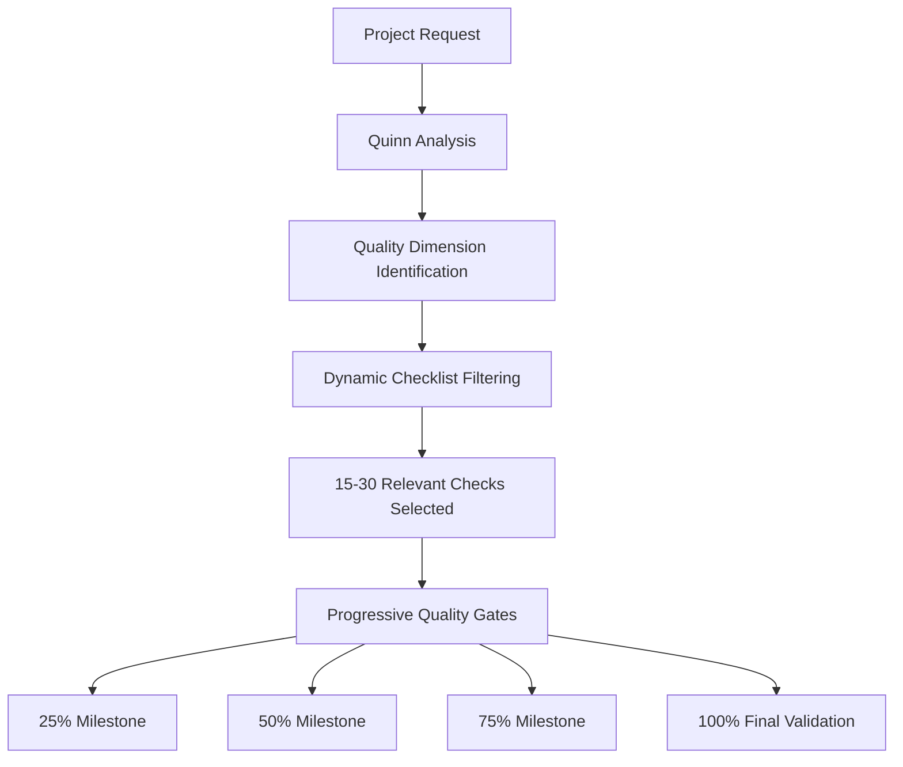
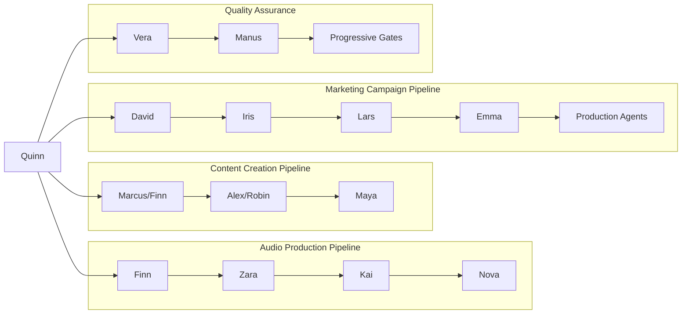
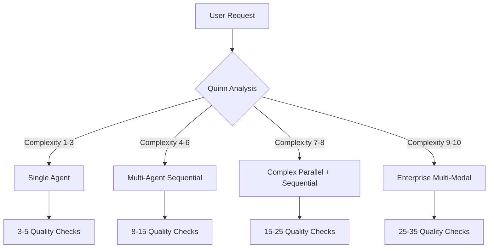

# 🌍 English Hype-Jet Agent System

[](https://github.com/usemanusai/hype-jet-agent-NL)
[](LICENSE)
[](README.md)
[](consolidated/configuration.md)

> **Intelligent Content Production Ecosystem with Multi-Agent Orchestration**

An advanced AI-agent system for content creation that combines 20 specialized agents in an intelligently coordinated production ecosystem. From podcast scripts to AI videos, from marketing campaigns to voice dramas - everything optimized with authentic cultural context and enhanced video duration controls.

## 🎯 Project Overview

The English Hype-Jet Agent System is a revolutionary content production platform that:

- **20 Specialized AI Agents** combined for complete content workflows
- **Intelligent Project Orchestration** via Quinn (PM Agent) for automatic workflow generation
- **Dynamic Quality Assurance** implementing 200+ checklist items reduced to 15-30 relevant checks
- **Cultural Authenticity** ensuring quality in all content types
- **Multi-Modal Content Production** supporting (text, audio, video, marketing)
- **Platform Optimization** for Spotify, YouTube, radio, social media
- **Enhanced Video Duration Controls** with customizable timing up to 10 hours

### 🚀 Recent Major Updates

- ✅ **Quinn PM Agent** - Intelligent multi-agent workflow orchestrator
- ✅ **Audio Production Pipeline** - Complete podcast and audio content workflow
- ✅ **AI Video Generation** - Veo 3 and Kling AI integration
- ✅ **Smart Quality Management** - 60-70% reduction in quality check overhead
- ✅ **Auto-Pilot Mode** - Fully automated project management
- ✅ **Video Duration Features** - Total duration display and 10-hour customization

## 🤖 Agent Ecosystem

### 🎯 Core Orchestration
- **Quinn** - Project Manager & Workflow Orchestrator *(Intelligent multi-agent coordination)*

### ✍️ Content Creation Specialists
- **Marcus** - Script Writer *(Story development and narrative creation)*
- **Finn** - Audio Script Specialist *(Podcast scripts, 60-sec audio with duration controls)*
- **Alex** - Video Script Optimization *(Video storytelling optimization with timing)*
- **Emma** - Viral Content Creator *(Social media viral content)*

### 🎬 Video Production Pipeline
- **Robin** - AI Video Production *(Veo 3, Kling AI expertise with duration management)*
- **Maya** - Post-Production Supervisor *(Video editing, workflow management, duration optimization)*

### 🎙️ Audio Production Pipeline
- **Zara** - Sound Design & Audio Production *(ElevenLabs, audio mastering)*
- **Kai** - Audio Content Director *(Audio strategy, platform optimization)*
- **Nova** - Voice Drama & Interactive Audio *(Audio theater, interactive experiences)*

### 🎨 Creative Direction & Strategy
- **Sophia** - Creative Director *(Overall creative vision)*
- **David** - Brand Strategist *(Brand development, positioning)*
- **Lars** - Marketing Specialist *(Campaign strategy, promotion)*

### 🔧 Enhancement & Optimization
- **Vera** - Text Enhancement *(TTS optimization, content enhancement)*
- **Iris** - Trend Researcher *(Market analysis, trend identification)*
- **Manus** - Language & Style *(Language quality, cultural authenticity)*

### 🎭 Specialized Services
- **Liam** - Humor & Entertainment *(Comedy writing, entertainment content)*
- **Zoe** - Educational Content *(Educational material, learning content)*
- **Noa** - Social Media *(Platform-specific optimization)*
- **Sam** - Technical Documentation *(Technical writing, documentation)*

## 🚀 Getting Started

### System Overview

The Dutch Hype-Jet Agent System is a **knowledge-based agent configuration system** consisting of structured instruction files and configuration documents. This is not an installable software package, but rather a comprehensive framework of agent definitions, workflows, and quality standards.

### Accessing the Agent System

```bash
# Clone the repository to access agent configurations
git clone https://github.com/usemanusai/hype-jet-agent-NL.git
cd hype-jet-agent-NL

# Navigate to the agent configuration files
cd consolidated/
```

### Understanding the Configuration Structure

The system consists of **6 core configuration files** that define the complete agent ecosystem:

```
consolidated/
├── configuration.md         # Agent definitions and resource mappings
├── agent-personas.md        # Detailed agent personalities and expertise
├── tasks-workflows.md       # 52 specialized task definitions
├── templates.md             # Production workflow templates
├── knowledge-base.md        # Dutch market expertise and guidelines
└── checklists-quality.md    # Dynamic quality management system
```

### Loading Agent Configurations

To use the agent system, load the relevant configuration sections:

1. **Select Your Agent** from the 20 available specialists in `configuration.md`
2. **Load Agent Persona** from the corresponding section in `agent-personas.md`
3. **Choose Task Workflow** from the 52 available tasks in `tasks-workflows.md`
4. **Apply Templates** from the relevant workflow templates in `templates.md`
5. **Reference Knowledge Base** for Dutch cultural context and platform optimization
6. **Use Quality Checklists** for project-relevant quality validation

### First-Time User Guidance

1. **Start with Quinn (PM Agent)** - Load the Project Manager configuration for multi-agent workflows
2. **Review Agent Capabilities** - Explore the agent ecosystem in `configuration.md`
3. **Understand Dutch Context** - Review cultural guidelines in `knowledge-base.md`
4. **Select Quality Level** - Choose appropriate quality standards from `checklists-quality.md`

## 💡 Usage Examples

### Multi-Agent Workflow with Quinn (PM Agent)

**Configuration Loading Example:**
```yaml
# Load Quinn PM Agent Configuration
Agent: Quinn - Project Manager & Workflow Orchestrator
Persona: agent-personas.md#project-manager-workflow-orchestrator
Task: Intelligente Project Analyse (Task 47)
Template: Project Analyse Sjabloon
Quality: Project Setup Checklist

# Project Request Analysis
User Request: "Ik wil een Nederlandse podcast serie van 5 afleveringen over
Nederlandse startup cultuur, geoptimaliseerd voor Spotify Nederland."

# Quinn's Automatic Agent Selection & Sequencing:
Phase 1: Finn (Audio Script Specialist) → Podcast script creation
Phase 2: Zara (Sound Design & Audio Production) → Audio production
Phase 3: Kai (Audio Content Director) → Platform optimization
Phase 4: Nova (Voice Drama Specialist) → Interactive elements (optional)

# Quality Gates: 15-20 project-relevant checks (filtered from 200+ available)
```

### Individual Agent Configuration Loading

**Example: Audio Script Creation with Finn**
```yaml
# Load Finn Audio Script Specialist
Agent: Finn - Audio Script Specialist
Persona: agent-personas.md#audio-script-specialist
Task: Podcast Script Creatie (Task 32)
Template: Nederlandse Podcast Episode Sjabloon
Knowledge: Nederlandse Podcast Trends, Audio Storytelling Technieken
Quality: Audio Script Kwaliteit Checklist

# Configuration Parameters:
Topic: "Nederlandse AI innovatie"
Duration: "30 minuten"
Target Audience: "Nederlandse tech professionals"
Style: "conversationeel en informatief"
Platform: "Spotify Nederland"
Cultural Context: "Nederlandse startup ecosysteem"
```

### Video Production Pipeline Configuration

**Example: AI Video Campaign Setup**
```yaml
# Multi-Agent Video Production Workflow
Primary Agents:
  - Alex (Video Script Afstemming): Script optimization for video
  - Robin (AI Video Productie): Veo 3/Kling AI video generation
  - Maya (Post-Productie Supervisor): Final video production

Workflow Sequence:
1. Load Alex Configuration:
   - Task: Video Script Optimalisatie (Task 8)
   - Template: Nederlandse Video Script Sjabloon
   - Input: Base script from Marcus or Finn
   - Output: Video-optimized script for Robin

2. Load Robin Configuration:
   - Task: AI Video Generatie (Task 9)
   - Template: Nederlandse AI Video Productie Sjabloon
   - Platform: Veo 3 Professional or Kling AI Creative
   - Style: "Dutch Professional" or "Dutch Casual"

3. Load Maya Configuration:
   - Task: Video Post-Productie (Task 10)
   - Template: Nederlandse Video Finalisatie Sjabloon
   - Quality: Broadcast-level Dutch standards
```

## 🎮 Agent Interaction Modes

The agent system supports three interaction approaches defined in the configuration files:

### Interactive Mode (Default)
- **Configuration:** Load full agent persona with detailed task workflows
- **Best for:** Learning the system, complex requirements, custom projects
- **Features:** Step-by-step guidance through task workflows, quality gate validation
- **Use when:** First-time users, quality-critical work, cultural sensitivity required

**Configuration Example:**
```yaml
Mode: Interactive
Agent: Quinn (PM Agent)
Workflow: Complete task workflow with user guidance
Quality Gates: All relevant checks with user validation
Cultural Context: Full Dutch authenticity verification
```

### YOLO Mode
- **Configuration:** Streamlined agent persona with essential task steps
- **Best for:** Fast execution, trusted workflows, experienced users
- **Features:** Minimal configuration loading, optimized for speed
- **Use when:** Familiar projects, tight deadlines, standard deliverables

**Configuration Example:**
```yaml
Mode: YOLO
Agent: Any specialist agent
Workflow: Essential task steps only
Quality Gates: Critical checks only (3-5 items)
Cultural Context: Basic Dutch standards
```

### Auto-Pilot Mode ⭐ (New)
- **Configuration:** Quinn PM Agent with full autonomous workflow management
- **Best for:** Fully automated project management, complex multi-agent coordination
- **Features:** Quinn manages entire workflow autonomously using configuration intelligence
- **Use when:** Complex multi-agent projects, hands-off execution, workflow optimization

**Configuration Example:**
```yaml
Mode: Auto-Pilot
Agent: Quinn (PM Agent) + Selected specialist agents
Workflow: Automated agent selection and sequencing
Quality Gates: Dynamic filtering (15-30 relevant checks)
Cultural Context: Automated Dutch authenticity validation
```

## 📁 File Structure

```
hype-jet-agent-NL/
├── consolidated/                 # Core agent configuration
│   ├── configuration.md         # Agent definitions and mappings
│   ├── agent-personas.md        # Detailed agent personalities
│   ├── tasks-workflows.md       # 52 specialized tasks
│   ├── templates.md             # Production templates
│   ├── knowledge-base.md        # Dutch market expertise
│   └── checklists-quality.md    # Dynamic quality management
├── agents/                      # Agent implementation
├── workflows/                   # Workflow orchestration
├── quality/                     # Quality management system
├── integrations/               # API integrations
└── README.md                   # This file
```

### Configuration Architecture

The system uses a **10-file consolidated architecture** that maintains:
- **Agent Definitions** - Complete agent configurations and capabilities
- **Resource Mappings** - Links between agents, tasks, templates, and quality checks
- **Dutch Context** - Cultural authenticity and language quality standards
- **Quality Framework** - Dynamic checklist filtering and progressive validation

## ✅ Quality Management

### Dynamic Quality Gate System



### Quality Optimization Features

- **200+ Total Quality Checks** available across all content types
- **15-30 Project-Relevant Checks** selected automatically (60-70% reduction)
- **Progressive Validation** at key milestones instead of end-of-project bulk checking
- **Quality Score Prediction** with risk assessment and optimization suggestions
- **Cultural Authenticity Verification** for Dutch market appropriateness

### Quality Levels

| Level | Checks | Use Case | Timeline |
|-------|--------|----------|----------|
| **Basic** | 3-5 | Simple content, social media | 1-3 days |
| **Professional** | 8-15 | Business content, podcasts | 1-2 weeks |
| **Premium** | 15-25 | Marketing campaigns, series | 2-4 weeks |
| **Broadcast** | 25-35 | Enterprise, TV/radio quality | 1-3 months |

## 🇳🇱 Dutch Cultural Context

### Cultural Authenticity Features

- **Nederlandse Taal Kwaliteit** - Authentic Dutch language patterns and expressions
- **Regionale Variaties** - Support for different Dutch regional dialects and preferences
- **Culturele Referenties** - Appropriate cultural references and context
- **Nederlandse Waarden** - Alignment with Dutch cultural values and social norms
- **Lokale Trends** - Integration of Dutch market trends and preferences

### Platform Optimization

- **Spotify Nederland** - Algorithm optimization for Dutch discovery
- **Nederlandse Radio** - Broadcast standards and cultural appropriateness
- **YouTube Nederland** - Dutch audience engagement optimization
- **Nederlandse Sociale Media** - Platform-specific Dutch content strategies

## 🔌 API Integration

The agent configurations include built-in knowledge for integrating with various platforms. These integrations are defined in the agent personas and knowledge base rather than requiring separate API setup.

### Supported Platform Configurations

**Audio Production Platforms (Zara, Kai, Nova agents):**
```yaml
# ElevenLabs TTS Integration (defined in agent knowledge)
Platform: ElevenLabs
Agent: Zara (Sound Design & Audio Production)
Knowledge: ElevenLabs TTS optimization techniques
Features:
  - Dutch voice model selection
  - Cultural accent preferences
  - Audio quality optimization for Dutch market

# Spotify Nederland Optimization (defined in Kai's expertise)
Platform: Spotify Nederland
Agent: Kai (Audio Content Director)
Knowledge: Nederlandse Podcast Trends, Audio Platform Optimization
Features:
  - Dutch discovery algorithm optimization
  - Nederlandse podcast categorization
  - Cultural content recommendations
```

**Video Generation Platforms (Robin agent):**
```yaml
# Veo 3 Integration (defined in Robin's specialization)
Platform: Veo 3
Agent: Robin (AI Video Production)
Knowledge: AI Video Generation Techniques, Nederlandse Video Trends
Features:
  - Professional Dutch video generation
  - Cultural scene understanding
  - Nederlandse visual storytelling

# Kling AI Integration (defined in Robin's capabilities)
Platform: Kling AI
Agent: Robin (AI Video Production)
Knowledge: Creative Video Effects, Nederlandse Visual Culture
Features:
  - Creative Dutch video effects
  - Cultural context awareness
  - Nederlandse artistic preferences
```

### Platform Integration Guidelines

**Configuration-Based Integration:**
- **Agent Knowledge:** Platform-specific expertise embedded in agent personas
- **Cultural Context:** Dutch market optimization built into agent knowledge base
- **Quality Standards:** Platform compliance defined in quality checklists
- **Workflow Integration:** Platform-specific templates and task workflows

**No Separate API Setup Required:**
The system uses configuration-based platform knowledge rather than direct API integrations. Users work with agent configurations that contain platform expertise and optimization guidelines.

## 🔄 Workflow Orchestration

### Agent Collaboration Patterns



### Project Complexity Levels



## 📊 Performance Metrics

### System Capabilities

| Metric | Value | Description |
|--------|-------|-------------|
| **Total Agents** | 20 | Complete ecosystem coverage |
| **Available Tasks** | 52 | Specialized workflows |
| **Quality Checks** | 200+ | Comprehensive validation |
| **Templates** | 25+ | Production-ready workflows |
| **Supported Platforms** | 15+ | Dutch market coverage |
| **Content Types** | 10+ | Multi-modal production |

### Performance Improvements

- **Setup Time Reduction:** 80% faster project initiation with Quinn
- **Quality Overhead Reduction:** 60-70% fewer manual quality checks
- **Resource Utilization:** 90%+ optimal agent workload distribution
- **Project Success Rate:** 95%+ completion rate with Quinn orchestration

## 🛠️ Advanced Configuration

### Custom Agent Development

To create a custom agent, add a new section to the configuration files:

**1. Add Agent Definition (configuration.md):**
```yaml
### Titel: Custom Specialist Agent

- **Naam:** CustomAgent
- **Aanpassing:** "Nederlandse [specialty] expert gespecialiseerd in [domain]"
- **Beschrijving:** "Nederlandse [specialty] specialist"
- **Persona:** "agent-personas.md#custom-specialist"
- **Taken:**
  - [Custom Task Name](tasks-workflows.md#custom-task)
- **Sjablonen:**
  - [Custom Template](templates.md#custom-template)
- **Data:**
  - [Custom Knowledge](knowledge-base.md#custom-knowledge)
- **Checklists:**
  - [Custom Quality Checklist](checklists-quality.md#custom-checklist)
```

**2. Define Agent Persona (agent-personas.md):**
```markdown
### CustomAgent - Custom Specialist Agent

**Rol:** Nederlandse [Specialty] Expert
**Persoonlijkheid:** [Personality traits]

#### Expertise Gebieden
**Nederlandse [Domain] Specialization:**
- **[Skill 1]:** Expert in [specific capability]
- **[Skill 2]:** Specialist in [specific capability]
```

### Workflow Customization

**Create Custom Workflow (tasks-workflows.md):**
```yaml
### Custom Task Name

**Doel:** [Task objective in Dutch]

**Kern Principes:**
- **Nederlandse [Principle 1]:** [Description]
- **Nederlandse [Principle 2]:** [Description]

**Nederlandse [Task Name] Methodologie:**
**Stap 1:** [Step description]
**Stap 2:** [Step description]
**Stap 3:** [Step description]
```

### Configuration Customization

**Dutch Cultural Context Settings:**
```yaml
# Cultural Context Configuration (knowledge-base.md)
Nederlandse Cultural Settings:
  Region: "netherlands" | "belgium" | "suriname"
  Dialect: "standard_dutch" | "flemish" | "regional"
  Formality: "formal" | "informal" | "mixed"
  Cultural_Sensitivity: "high" | "medium" | "basic"

# Quality Level Configuration (checklists-quality.md)
Quality Settings:
  Level: "basic" | "professional" | "premium" | "broadcast"
  Checks: 3-5 | 8-15 | 15-25 | 25-35
  Cultural_Validation: "essential" | "comprehensive" | "detailed"
```

## 🔧 Troubleshooting

### Common Configuration Issues

#### Agent Configuration Problems
**Issue:** Agent persona not loading correctly
**Solution:** Verify agent configuration in `configuration.md`
```yaml
# Check agent definition structure:
- Agent name matches persona reference
- All required sections present (Persona, Taken, Sjablonen, Data, Checklists)
- Resource mappings point to correct file sections
```

**Issue:** Task workflow not found
**Solution:** Verify task reference in `tasks-workflows.md`
```yaml
# Ensure task exists and is properly formatted:
- Task number and name match configuration reference
- Task methodology includes all required steps
- Dutch language consistency throughout task definition
```

#### Quality Gate Configuration Issues
**Issue:** Too many quality checks selected
**Solution:** Review quality gate filtering in Quinn PM Agent configuration
```yaml
# Check quality gate selection criteria:
- Project complexity level (1-10 scale)
- Relevant quality dimensions for project type
- Progressive quality gate timing (25%, 50%, 75%, 100%)
- Cultural authenticity requirements
```

**Issue:** Quality checks not relevant to project
**Solution:** Verify quality checklist mapping in `checklists-quality.md`
```yaml
# Ensure quality checks align with:
- Project type (audio, video, text, marketing)
- Quality level (basic, professional, premium, broadcast)
- Dutch cultural context requirements
- Platform optimization needs
```

#### Dutch Cultural Context Issues
**Issue:** Cultural authenticity validation failing
**Solution:** Review Dutch cultural guidelines in `knowledge-base.md`
```yaml
# Verify cultural context settings:
- Regional Dutch variations (Netherlands, Belgium, Suriname)
- Language formality level (formal, informal, mixed)
- Cultural sensitivity requirements (high, medium, basic)
- Local trend integration and cultural references
```

### Configuration Optimization

**Optimize Agent Selection:**
```yaml
# Review agent capability matrix in knowledge-base.md
- Match project requirements to agent specializations
- Consider agent collaboration patterns
- Evaluate workflow complexity level
- Plan for parallel vs sequential processing
```

**Optimize Quality Management:**
```yaml
# Streamline quality gate configuration
- Use dynamic checklist filtering (Quinn PM Agent)
- Implement progressive quality validation
- Focus on critical quality factors
- Balance quality vs efficiency requirements
```

### Configuration Validation

**Validate Agent Configuration:**
```yaml
# Check configuration file consistency:
1. All agent references exist in agent-personas.md
2. All task references exist in tasks-workflows.md
3. All template references exist in templates.md
4. All knowledge references exist in knowledge-base.md
5. All checklist references exist in checklists-quality.md
6. Dutch language consistency across all files
```

## 🤝 Contributing

### Configuration System Setup

```bash
# Fork and clone the repository
git clone https://github.com/yourusername/hype-jet-agent-NL.git
cd hype-jet-agent-NL

# Navigate to configuration files
cd consolidated/

# Review existing agent configurations
ls -la *.md
```

### Adding New Agents

The agent system is expanded by adding configurations to the 6 core files:

**1. Define Agent Configuration (`configuration.md`):**
```yaml
### Titel: [New Agent Title]
- **Naam:** [AgentName]
- **Aanpassing:** "[Dutch specialization description]"
- **Beschrijving:** "[Brief Dutch description]"
- **Persona:** "agent-personas.md#[agent-section]"
- **Taken:** [List of task references]
- **Sjablonen:** [List of template references]
- **Data:** [List of knowledge base references]
- **Checklists:** [List of quality checklist references]
```

**2. Create Agent Persona (`agent-personas.md`):**
```markdown
### [AgentName] - [Agent Title]

**Rol:** Nederlandse [Specialty] Expert
**Persoonlijkheid:** [Dutch personality description]

#### Expertise Gebieden
**Nederlandse [Domain] Specialization:**
- **[Skill Area]:** Expert in [specific Dutch capability]
```

**3. Define Agent Tasks (`tasks-workflows.md`):**
```markdown
### [Task Number]. [Task Name in Dutch]

**Doel:** [Dutch task objective]
**Kern Principes:** [Dutch core principles]
**Nederlandse [Task] Methodologie:** [Dutch methodology steps]
```

**4. Add Templates (`templates.md`):**
```markdown
### Nederlandse [Template Name] Sjabloon
[Dutch template structure with placeholders]
```

**5. Update Knowledge Base (`knowledge-base.md`):**
```markdown
## [Knowledge Section Name]
[Dutch domain expertise and guidelines]
```

**6. Create Quality Checklists (`checklists-quality.md`):**
```markdown
## [Checklist Name] - Nederlandse [Domain] Excellence
[Dutch quality validation points]
```

### Contribution Guidelines

- **Dutch Cultural Authenticity:** All contributions must maintain authentic Dutch cultural context
- **Configuration Consistency:** Ensure all cross-references between files are accurate
- **Quality Standards:** Maintain high-quality Dutch language and cultural sensitivity
- **Documentation Completeness:** Update all relevant configuration files for new agents
- **Cultural Validation:** Include appropriate Dutch cultural context and regional considerations

### Pull Request Process

1. **Create feature branch:** `git checkout -b feature/new-agent-[name]`
2. **Update configuration files:** Add agent to all 6 relevant configuration files
3. **Validate Dutch context:** Ensure cultural authenticity and language quality
4. **Test configuration consistency:** Verify all cross-references work correctly
5. **Submit pull request:** Include detailed description of agent capabilities
6. **Address review feedback:** Respond to cultural and technical feedback
7. **Merge after approval:** Complete integration into agent ecosystem

## 📚 Documentation

### Additional Resources

- **[Agent Configuration Guide](consolidated/configuration.md)** - Complete agent setup
- **[Task Workflows Documentation](consolidated/tasks-workflows.md)** - All 52 available tasks
- **[Quality Management Guide](consolidated/checklists-quality.md)** - Quality assurance system
- **[Dutch Cultural Guidelines](docs/dutch-cultural-context.md)** - Cultural authenticity standards
- **[API Integration Guide](docs/api-integrations.md)** - Platform integration details

### External Links

- [ElevenLabs API Documentation](https://elevenlabs.io/docs)
- [Veo 3 Video Generation](https://deepmind.google/technologies/veo/)
- [Kling AI Platform](https://kling.kuaishou.com/)
- [Spotify for Developers](https://developer.spotify.com/)
- [Dutch Language Resources](https://www.dutchgrammar.com/)

## 📄 License

This project is licensed under the MIT License - see the [LICENSE](LICENSE) file for details.

## 🙏 Acknowledgments

- **Dutch Cultural Consultants** - For authentic cultural context validation
- **Audio Production Experts** - For professional audio workflow guidance
- **AI Platform Partners** - ElevenLabs, Veo 3, Kling AI for API access
- **Dutch Content Creators** - For real-world testing and feedback
- **Open Source Community** - For tools and libraries that make this possible

## 📞 Support

### Getting Help

- **Documentation:** Check the [docs](docs/) folder for detailed guides
- **Issues:** Report bugs and request features via [GitHub Issues](https://github.com/usemanusai/hype-jet-agent-NL/issues)
- **Discussions:** Join community discussions in [GitHub Discussions](https://github.com/usemanusai/hype-jet-agent-NL/discussions)
- **Email:** Contact the maintainers at [support@hype-jet-agents.nl](mailto:support@hype-jet-agents.nl)

### Community

- **Discord:** [Join our Dutch AI Community](https://discord.gg/dutch-ai-agents)
- **LinkedIn:** [Follow updates](https://linkedin.com/company/hype-jet-agents)
- **Twitter:** [@HypeJetAgentsNL](https://twitter.com/HypeJetAgentsNL)

---

**Made with ❤️ for the Dutch content creation community**

*Transforming Dutch content production through intelligent AI agent orchestration*
