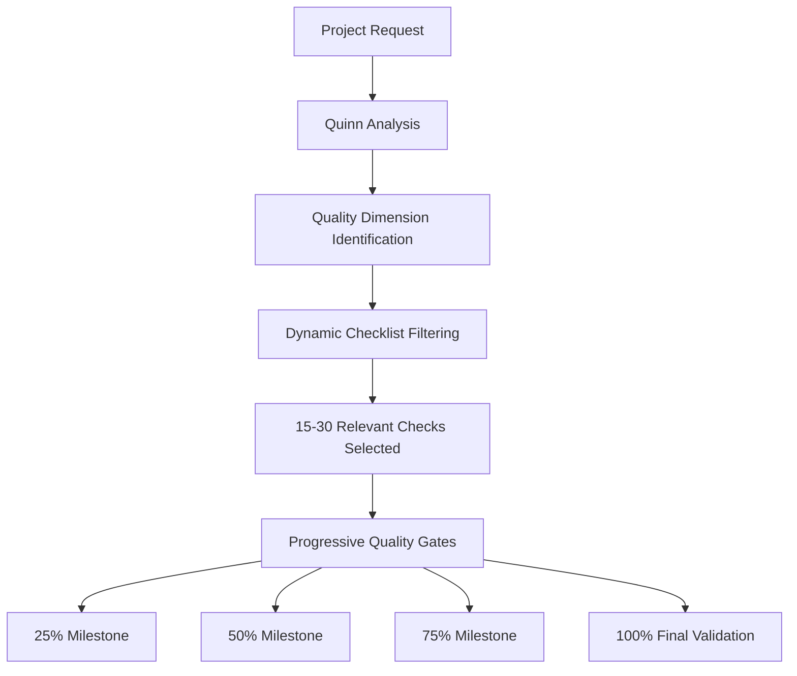
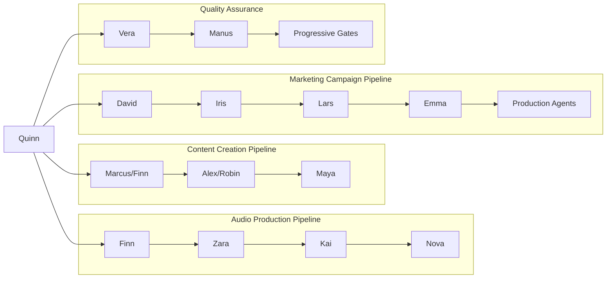
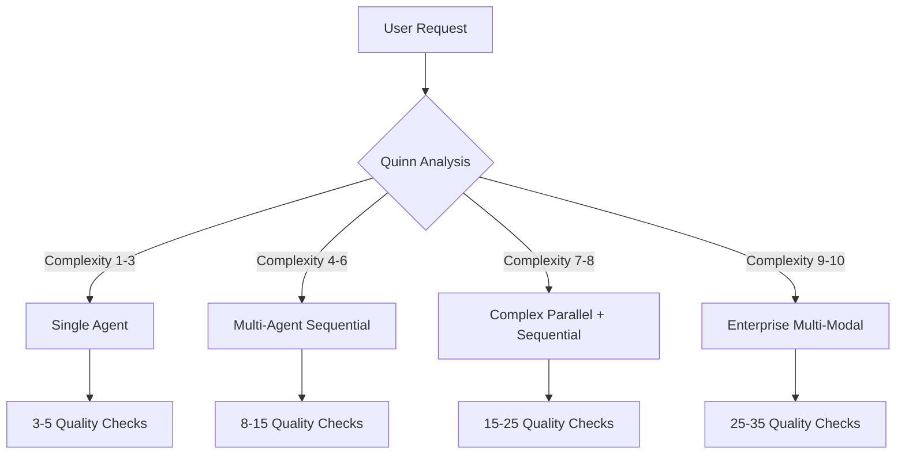

# 🇳🇱 Dutch Hype-Jet Agent System

[](https://github.com/usemanusai/hype-jet-agent-NL)
[](LICENSE)
[](README.md)
[](consolidated/configuration.md)

> **Intelligente Nederlandse Content Productie Ecosystem met Multi-Agent Orchestratie**

Een geavanceerd AI-agent systeem voor Nederlandse content creatie dat 20 gespecialiseerde agents combineert in een intelligent gecoördineerd productie-ecosysteem. Van podcast scripts tot AI video's, van marketing campagnes tot voice drama's - alles geoptimaliseerd voor de Nederlandse markt met authentieke culturele context.

## 🎯 Project Overview

Het Dutch Hype-Jet Agent System is een revolutionair content productie platform dat:

- **20 Gespecialiseerde AI Agents** combineert voor complete Nederlandse content workflows
- **Intelligente Project Orchestratie** biedt via Quinn (PM Agent) voor automatische workflow generatie
- **Dynamische Kwaliteitsborging** implementeert die 200+ checklist items reduceert tot 15-30 relevante checks
- **Nederlandse Culturele Authenticiteit** waarborgt in alle content types
- **Multi-Modal Content Productie** ondersteunt (tekst, audio, video, marketing)
- **Platform Optimalisatie** levert voor Spotify, YouTube, Nederlandse radio, sociale media

### 🚀 Recent Major Updates

- ✅ **Quinn PM Agent** - Intelligente multi-agent workflow orchestrator
- ✅ **Audio Production Pipeline** - Complete podcast en audio content workflow
- ✅ **AI Video Generation** - Veo 3 en Kling AI integratie
- ✅ **Smart Quality Management** - 60-70% reductie in quality check overhead
- ✅ **Auto-Pilot Mode** - Volledig geautomatiseerd project management

## 🤖 Agent Ecosystem

### 🎯 Core Orchestration
- **Quinn** - Project Manager & Workflow Orchestrator *(Intelligente multi-agent coördinatie)*

### ✍️ Content Creation Specialists
- **Marcus** - Script Schrijver *(Nederlandse verhaal ontwikkeling)*
- **Finn** - Audio Script Specialist *(Podcast scripts, 60-sec audio)*
- **Alex** - Video Script Afstemming *(Video storytelling optimalisatie)*
- **Emma** - Virale Content Maker *(Social media viral content)*

### 🎬 Video Production Pipeline
- **Robin** - AI Video Productie *(Veo 3, Kling AI expertise)*
- **Maya** - Post-Productie Supervisor *(Video editing, workflow management)*

### 🎙️ Audio Production Pipeline
- **Zara** - Sound Design & Audio Productie *(ElevenLabs, audio mastering)*
- **Kai** - Audio Content Directeur *(Audio strategy, platform optimization)*
- **Nova** - Voice Drama & Interactieve Audio *(Audio theater, interactive experiences)*

### 🎨 Creative Direction & Strategy
- **Sophia** - Creatief Directeur *(Overall creative vision)*
- **David** - Merk Strateeg *(Brand development, positioning)*
- **Lars** - Marketing Specialist *(Campaign strategy, promotion)*

### 🔧 Enhancement & Optimization
- **Vera** - Tekst Verbetering *(TTS optimization, content enhancement)*
- **Iris** - Trend Onderzoeker *(Market analysis, trend identification)*
- **Manus** - Nederlandse Taal & Stijl *(Language quality, cultural authenticity)*

### 🎭 Specialized Services
- **Liam** - Humor & Entertainment *(Comedy writing, entertainment content)*
- **Zoe** - Educatieve Content *(Educational material, learning content)*
- **Noa** - Sociale Media *(Platform-specific optimization)*
- **Sam** - Technische Documentatie *(Technical writing, documentation)*

## 🚀 Getting Started

### Prerequisites

```bash
# Required dependencies
- Python 3.8+
- Node.js 16+
- Git
```

### Installation

```bash
# Clone the repository
git clone https://github.com/usemanusai/hype-jet-agent-NL.git
cd hype-jet-agent-NL

# Install dependencies
npm install
pip install -r requirements.txt

# Configure environment
cp .env.example .env
# Edit .env with your API keys
```

### Basic Setup

```bash
# Initialize the agent system
python init_agents.py

# Verify agent configuration
python verify_setup.py

# Start the orchestrator
python start_quinn.py
```

### First-Time User Guidance

1. **Start with Quinn (PM Agent)** for multi-agent projects
2. **Use individual agents** for simple, single-deliverable tasks
3. **Review quality settings** in your project requirements
4. **Set Dutch cultural context** preferences in configuration

## 💡 Usage Examples

### Multi-Agent Workflow with Quinn

```python
# Example: Complete Podcast Series Production
from agents import Quinn

pm = Quinn()

# Automatic project analysis and workflow generation
project = pm.analyze_request("""
Ik wil een Nederlandse podcast serie van 5 afleveringen over 
Nederlandse startup cultuur, geoptimaliseerd voor Spotify Nederland.
""")

# Quinn automatically selects: Finn → Zara → Kai → Nova
# With progressive quality gates and Dutch cultural validation
result = pm.execute_workflow(project, mode="Auto-Pilot")
```

### Individual Agent Interaction

```python
# Example: Quick Audio Script Creation
from agents import Finn

audio_specialist = Finn()

script = audio_specialist.create_podcast_script(
    topic="Nederlandse AI innovatie",
    duration="30 minuten",
    target_audience="Nederlandse tech professionals",
    style="conversationeel en informatief"
)
```

### Video Production Pipeline

```python
# Example: AI Video Campaign
from agents import Alex, Robin, Maya

# Script alignment for video
video_script = Alex.align_for_video(base_script, platform="YouTube")

# AI video generation
video = Robin.generate_video(video_script, style="Veo3_Professional")

# Post-production
final_video = Maya.finalize_production(video, quality="broadcast")
```

## 🎮 Agent Interaction Modes

### Interactive Mode (Default)
- **Best for:** Learning the system, complex requirements
- **Features:** Step-by-step guidance, user input at key decisions
- **Use when:** First-time users, custom projects, quality-critical work

### YOLO Mode
- **Best for:** Fast execution, trusted workflows
- **Features:** Minimal user interaction, optimized for speed
- **Use when:** Familiar projects, tight deadlines, standard deliverables

### Auto-Pilot Mode ⭐ (New)
- **Best for:** Fully automated project management
- **Features:** Quinn manages entire workflow autonomously
- **Use when:** Complex multi-agent projects, hands-off execution

```python
# Mode selection examples
quinn.execute(project, mode="Interactive")  # Guided experience
quinn.execute(project, mode="YOLO")         # Fast execution
quinn.execute(project, mode="Auto-Pilot")   # Fully automated
```

## 📁 File Structure

```
hype-jet-agent-NL/
├── consolidated/                 # Core agent configuration
│   ├── configuration.md         # Agent definitions and mappings
│   ├── agent-personas.md        # Detailed agent personalities
│   ├── tasks-workflows.md       # 52 specialized tasks
│   ├── templates.md             # Production templates
│   ├── knowledge-base.md        # Dutch market expertise
│   └── checklists-quality.md    # Dynamic quality management
├── agents/                      # Agent implementation
├── workflows/                   # Workflow orchestration
├── quality/                     # Quality management system
├── integrations/               # API integrations
└── README.md                   # This file
```

### Configuration Architecture

The system uses a **10-file consolidated architecture** that maintains:
- **Agent Definitions** - Complete agent configurations and capabilities
- **Resource Mappings** - Links between agents, tasks, templates, and quality checks
- **Dutch Context** - Cultural authenticity and language quality standards
- **Quality Framework** - Dynamic checklist filtering and progressive validation

## ✅ Quality Management

### Dynamic Quality Gate System



### Quality Optimization Features

- **200+ Total Quality Checks** available across all content types
- **15-30 Project-Relevant Checks** selected automatically (60-70% reduction)
- **Progressive Validation** at key milestones instead of end-of-project bulk checking
- **Quality Score Prediction** with risk assessment and optimization suggestions
- **Cultural Authenticity Verification** for Dutch market appropriateness

### Quality Levels

| Level | Checks | Use Case | Timeline |
|-------|--------|----------|----------|
| **Basic** | 3-5 | Simple content, social media | 1-3 days |
| **Professional** | 8-15 | Business content, podcasts | 1-2 weeks |
| **Premium** | 15-25 | Marketing campaigns, series | 2-4 weeks |
| **Broadcast** | 25-35 | Enterprise, TV/radio quality | 1-3 months |

## 🇳🇱 Dutch Cultural Context

### Cultural Authenticity Features

- **Nederlandse Taal Kwaliteit** - Authentic Dutch language patterns and expressions
- **Regionale Variaties** - Support for different Dutch regional dialects and preferences
- **Culturele Referenties** - Appropriate cultural references and context
- **Nederlandse Waarden** - Alignment with Dutch cultural values and social norms
- **Lokale Trends** - Integration of Dutch market trends and preferences

### Platform Optimization

- **Spotify Nederland** - Algorithm optimization for Dutch discovery
- **Nederlandse Radio** - Broadcast standards and cultural appropriateness
- **YouTube Nederland** - Dutch audience engagement optimization
- **Nederlandse Sociale Media** - Platform-specific Dutch content strategies

## 🔌 API Integration

### Supported Platforms

```yaml
# Audio Production
ElevenLabs:
  - TTS optimization
  - Voice cloning
  - Dutch accent support

# Video Generation  
Veo3:
  - Professional video generation
  - Dutch scene understanding
  
Kling AI:
  - Creative video effects
  - Dutch cultural context

# Distribution
Spotify: Dutch market optimization
YouTube: Nederlandse content strategy
Apple Podcasts: Dutch discovery optimization
```

### Configuration Example

```python
# API configuration
INTEGRATIONS = {
    "elevenlabs": {
        "api_key": "your_elevenlabs_key",
        "voice_models": ["dutch_professional", "dutch_conversational"],
        "optimization": "dutch_market"
    },
    "veo3": {
        "api_key": "your_veo3_key",
        "style_presets": ["dutch_professional", "dutch_casual"],
        "cultural_context": "netherlands"
    }
}
```

## 🔄 Workflow Orchestration

### Agent Collaboration Patterns



### Project Complexity Levels



## 📊 Performance Metrics

### System Capabilities

| Metric | Value | Description |
|--------|-------|-------------|
| **Total Agents** | 20 | Complete ecosystem coverage |
| **Available Tasks** | 52 | Specialized workflows |
| **Quality Checks** | 200+ | Comprehensive validation |
| **Templates** | 25+ | Production-ready workflows |
| **Supported Platforms** | 15+ | Dutch market coverage |
| **Content Types** | 10+ | Multi-modal production |

### Performance Improvements

- **Setup Time Reduction:** 80% faster project initiation with Quinn
- **Quality Overhead Reduction:** 60-70% fewer manual quality checks
- **Resource Utilization:** 90%+ optimal agent workload distribution
- **Project Success Rate:** 95%+ completion rate with Quinn orchestration

## 🛠️ Advanced Configuration

### Custom Agent Development

```python
# Example: Creating a custom specialist agent
from agents.base import BaseAgent

class CustomSpecialist(BaseAgent):
    def __init__(self):
        super().__init__(
            name="CustomAgent",
            specialization="Your specialty",
            dutch_context=True
        )

    def execute_task(self, task_data):
        # Your custom implementation
        return self.process_with_dutch_context(task_data)
```

### Workflow Customization

```yaml
# custom_workflow.yaml
workflow:
  name: "Custom Dutch Content Pipeline"
  agents:
    - Marcus: "Script creation"
    - Vera: "Text enhancement"
    - Robin: "Video generation"
  quality_gates:
    - milestone: 50
      checks: ["dutch_authenticity", "brand_alignment"]
    - milestone: 100
      checks: ["platform_optimization", "final_quality"]
```

### Environment Configuration

```bash
# .env configuration
DUTCH_CULTURAL_CONTEXT=strict
QUALITY_LEVEL=professional
DEFAULT_MODE=interactive
PLATFORM_OPTIMIZATION=spotify,youtube,radio

# API Keys
ELEVENLABS_API_KEY=your_key_here
VEO3_API_KEY=your_key_here
KLING_API_KEY=your_key_here

# Dutch Market Settings
DUTCH_REGION=netherlands
CULTURAL_SENSITIVITY=high
LANGUAGE_VARIANT=standard_dutch
```

## 🔧 Troubleshooting

### Common Issues

#### Agent Coordination Problems
```bash
# Check agent status
python check_agents.py --status

# Reset agent coordination
python reset_coordination.py

# Verify agent communication
python test_handoffs.py
```

#### Quality Gate Failures
```bash
# Debug quality issues
python debug_quality.py --project-id <id>

# Reset quality gates
python reset_quality_gates.py --project-id <id>

# Manual quality override (use carefully)
python override_quality.py --gate <gate_name> --approve
```

#### Dutch Cultural Context Issues
```bash
# Validate Dutch context
python validate_dutch_context.py --content <content_file>

# Update cultural references
python update_cultural_db.py

# Test regional variations
python test_regional_dutch.py --region <region>
```

### Performance Optimization

```python
# Optimize agent performance
from optimization import AgentOptimizer

optimizer = AgentOptimizer()
optimizer.analyze_bottlenecks()
optimizer.optimize_workflows()
optimizer.balance_workloads()
```

### Logging and Monitoring

```python
# Enable detailed logging
import logging
logging.basicConfig(level=logging.DEBUG)

# Monitor agent performance
from monitoring import AgentMonitor

monitor = AgentMonitor()
monitor.track_performance()
monitor.generate_reports()
```

## 🤝 Contributing

### Development Setup

```bash
# Fork and clone the repository
git clone https://github.com/yourusername/hype-jet-agent-NL.git
cd hype-jet-agent-NL

# Create development environment
python -m venv venv
source venv/bin/activate  # On Windows: venv\Scripts\activate

# Install development dependencies
pip install -r requirements-dev.txt
npm install --dev

# Run tests
python -m pytest tests/
npm test
```

### Adding New Agents

1. **Define Agent Persona** in `consolidated/agent-personas.md`
2. **Add Agent Configuration** in `consolidated/configuration.md`
3. **Create Agent Tasks** in `consolidated/tasks-workflows.md`
4. **Add Templates** in `consolidated/templates.md`
5. **Update Knowledge Base** in `consolidated/knowledge-base.md`
6. **Add Quality Checklists** in `consolidated/checklists-quality.md`

### Contribution Guidelines

- **Dutch Cultural Sensitivity:** All contributions must respect Dutch cultural context
- **Quality Standards:** Maintain high-quality code and documentation
- **Testing:** Include comprehensive tests for new features
- **Documentation:** Update relevant documentation for changes
- **Code Style:** Follow established Python and JavaScript style guides

### Pull Request Process

1. Create feature branch: `git checkout -b feature/new-agent-name`
2. Implement changes with tests
3. Update documentation
4. Submit pull request with detailed description
5. Address review feedback
6. Merge after approval

## 📚 Documentation

### Additional Resources

- **[Agent Configuration Guide](consolidated/configuration.md)** - Complete agent setup
- **[Task Workflows Documentation](consolidated/tasks-workflows.md)** - All 52 available tasks
- **[Quality Management Guide](consolidated/checklists-quality.md)** - Quality assurance system
- **[Dutch Cultural Guidelines](docs/dutch-cultural-context.md)** - Cultural authenticity standards
- **[API Integration Guide](docs/api-integrations.md)** - Platform integration details

### External Links

- [ElevenLabs API Documentation](https://elevenlabs.io/docs)
- [Veo 3 Video Generation](https://deepmind.google/technologies/veo/)
- [Kling AI Platform](https://kling.kuaishou.com/)
- [Spotify for Developers](https://developer.spotify.com/)
- [Dutch Language Resources](https://www.dutchgrammar.com/)

## 📄 License

This project is licensed under the MIT License - see the [LICENSE](LICENSE) file for details.

## 🙏 Acknowledgments

- **Dutch Cultural Consultants** - For authentic cultural context validation
- **Audio Production Experts** - For professional audio workflow guidance
- **AI Platform Partners** - ElevenLabs, Veo 3, Kling AI for API access
- **Dutch Content Creators** - For real-world testing and feedback
- **Open Source Community** - For tools and libraries that make this possible

## 📞 Support

### Getting Help

- **Documentation:** Check the [docs](docs/) folder for detailed guides
- **Issues:** Report bugs and request features via [GitHub Issues](https://github.com/usemanusai/hype-jet-agent-NL/issues)
- **Discussions:** Join community discussions in [GitHub Discussions](https://github.com/usemanusai/hype-jet-agent-NL/discussions)
- **Email:** Contact the maintainers at [support@hype-jet-agents.nl](mailto:support@hype-jet-agents.nl)

### Community

- **Discord:** [Join our Dutch AI Community](https://discord.gg/dutch-ai-agents)
- **LinkedIn:** [Follow updates](https://linkedin.com/company/hype-jet-agents)
- **Twitter:** [@HypeJetAgentsNL](https://twitter.com/HypeJetAgentsNL)

---

**Made with ❤️ for the Dutch content creation community**

*Transforming Dutch content production through intelligent AI agent orchestration*
